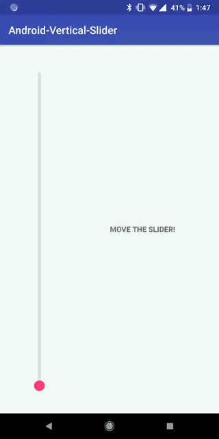

Android-Vertical-Slider
============================

A simple SeekBar-alike slider that can be scrolled vertically



Usage
-----
```gradle
dependencies {
    compile 'com.github.bosphere:android-verticalslider:1.0.3'
}
```

```xml
<com.bosphere.verticalslider.VerticalSlider
    android:layout_width="wrap_content"
    android:layout_height="match_parent"
    android:padding="32dp"
    app:vs_thumb_color="@color/colorAccent"
    app:vs_thumb_radius="10dp"
    app:vs_track_bg_color="#DFDFDF"
    app:vs_track_bg_thickness="6dp"
    app:vs_track_fg_color="@color/colorAccent"
    app:vs_track_fg_thickness="2dp"/>
```

```java
VerticalSlider vs = findViewById(R.id.vertical_slider);
vs.setOnSliderProgressChangeListener(new VerticalSlider.OnProgressChangeListener() {
    @Override
    public void onProgress(float progress) {
        // get progress here
    }
});
```

Customization
-------------

| Property | XML Attribute | Java Method |
| -------- | ------------- | ----------- |
| Thumb size | `vs_thumb_radius` | `setThumbRadiusPx(int radiusPx)` |
| Thumb color | `vs_thumb_color` | `setThumbColor(int color)` |
| Track thickness | `vs_track_fg_thickness` | `setTrackFgThicknessPx(int heightPx)` |
| Track thickness (background) | `vs_track_bg_thickness` | `setTrackBgThicknessPx(int heightPx)` |
| Track color | `vs_track_fg_color` | `setTrackFgColor(int color)` |
| Track color (background) | `vs_track_bg_color` | `setTrackBgColor(int color)` |


Compatibility
-------------

API 9 (Android 2.3) and up

License
-------

Copyright 2018 Yang Bo

Licensed under the Apache License, Version 2.0 (the "License");
you may not use this file except in compliance with the License.
You may obtain a copy of the License at

   http://www.apache.org/licenses/LICENSE-2.0

Unless required by applicable law or agreed to in writing, software
distributed under the License is distributed on an "AS IS" BASIS,
WITHOUT WARRANTIES OR CONDITIONS OF ANY KIND, either express or implied.
See the License for the specific language governing permissions and
limitations under the License.